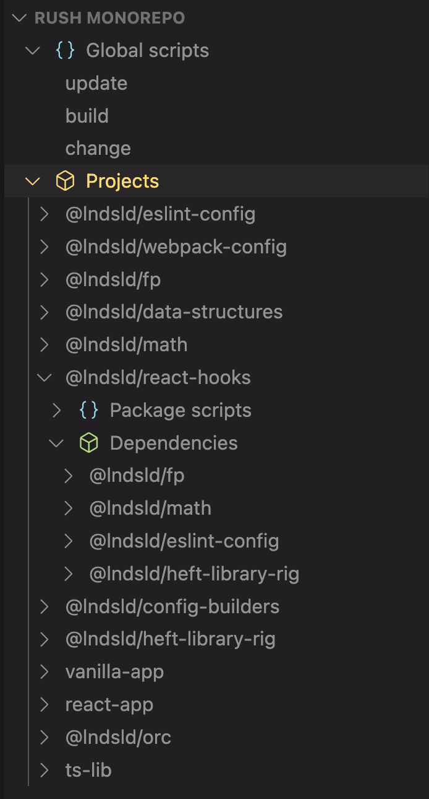

# Rush VSCode extension

Extension with some shortcuts for work with [@microsoft/rush](https://rushjs.io) monorepo.

## Features

- Make everyday work in VSCode GUI (`rush update`, `rush build`, `rush change`)

- Build project's dependencies

- Explore monorepo structure in tree view

- Run package scripts from tree view or from command palette

## Requirements

Make sure [@microsoft/rush](https://rushjs.io) installed.
